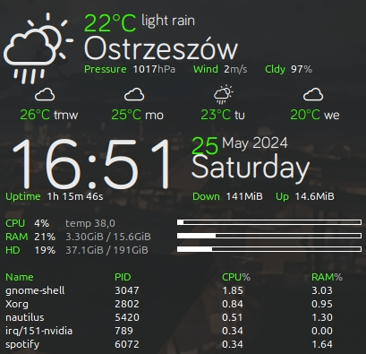

# Conky Weather Clock Smiady
A simple conky that displays the current weather, forecast for the next 4 days, clock and basic system parameters.
<div align="center"></div>

## Requirements

The  dependencies are conky-all, lua5.3, jq and lm-sensors.

You can install them via terminal (Ctrl + Alt + t):
```
sudo apt install conky-all lua5.3 jq lm-sensors
```

## Install
* Install fonts located in _fonts/_ folder.
* Install repository:
```
mkdir -p ~/.conky
git clone https://github.com/smiady/conky-weather-clock-smiady.git ~/.conky/
```

## Configuration
Get your _API key_ and _city id_ from [OpenWeather](https://openweathermap.org), then put this data in _weather_access.sh_:
```
APP_ID=xxx
CITY_ID=0
```
In _config_ file you can change position:
```
alignment = 'middle_right',
gap_x = 10,
gap_y = 31,
```
**alignment**

Aligned position on screen, may be _top_left_, _top_right_, _top_middle_, _bottom_left_, _bottom_right_, _bottom_middle_, _middle_left_, _middle_middle_, _middle_right_, or _none_.

**gap_x**

Gap, in pixels, between right or left border of screen.

**gap_y**

Gap, in pixels, between top or bottom border of screen.

In _config_ file you can also change colors:
```
own_window_colour = '282828',
own_window_argb_visual = true,
own_window_argb_value = 230,
	
color1 = '33ff00',
color2 = '9a9d9f'
```

**own_window_colour**

Set a specified background colour. Takes either a hex value or a valid RGB name.

**own_window_argb_value**

Set opacity in the range 0 - 255.

**color1**

Default hex font color currently set to green.

**color2**

Muted text is set to gray.

For more information about variables, please refer to the https://conky.sourceforge.net/variables.html.

## How to run
Once everything is installed and configured you can launch it easily:

```
~/.conky/conky-weather-clock-smiady/run
```

Don't forget to set this command in _Startup Applications_.

## Possible problems
Conky works fine on Ubuntu 24.04 Gnome, but there are problems on other distributions where the bottom is cut off.

To solve this problem, add more empty enters to the end of the _conky.text_ array.
```
${lua_parse top}
${offset 400}


]]
```

## Credits
* Font weather icons is taken from [Open Weather Icons](https://github.com/isneezy/open-weather-icons).